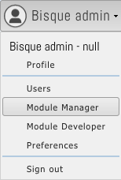
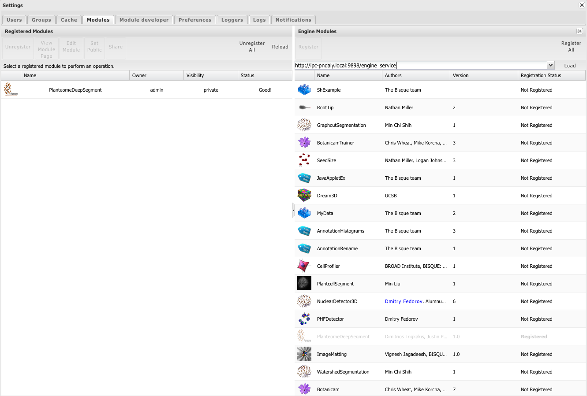
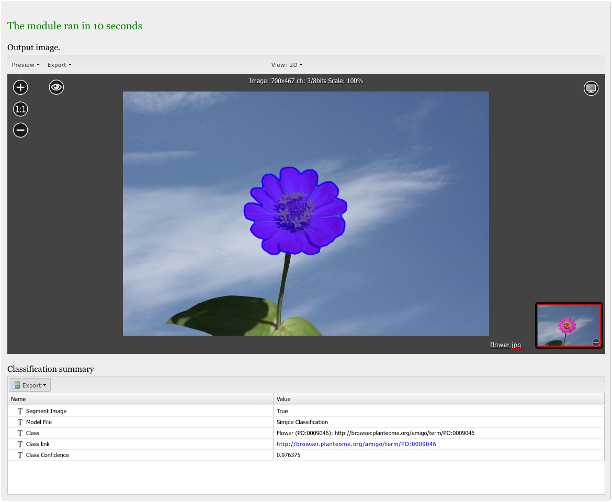
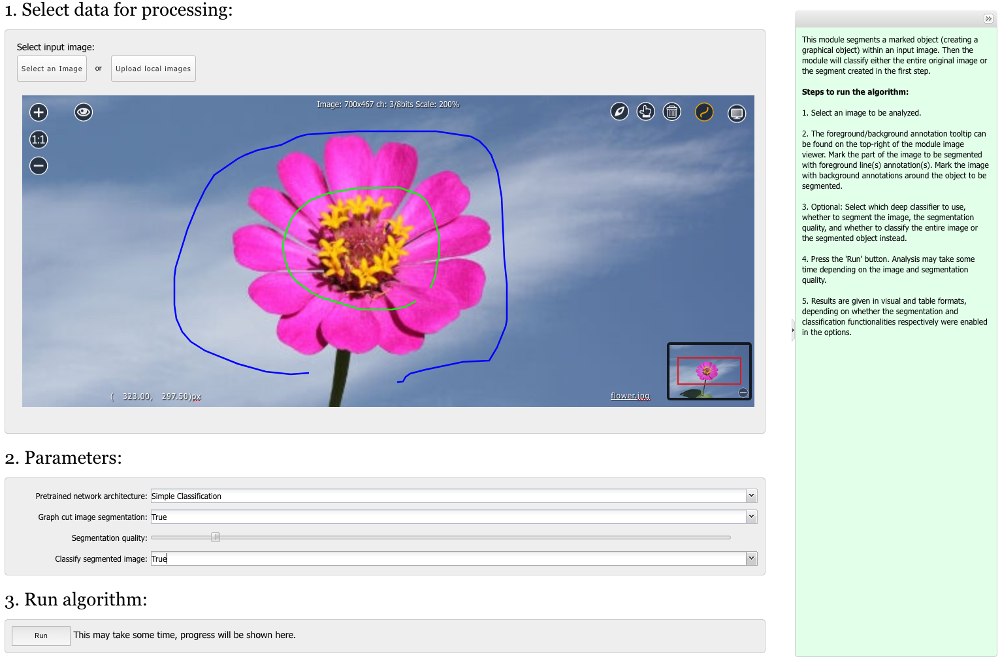

|CyVerse logo|_

|Home_Icon|_
`Learning Center Home <http://learning.cyverse.org/>`_

.. _step6.rst:

Run The Module
--------------

**The module should now work within the running BisQue docker container!**

If you are running on a Mac, localhost does not appear to work correctly. Instead, you need the hostname of your
machine. In the remainder of this section, we will use the author's local hostname (but you must use yours!):

.. code-block:: bash
  :emphasize-lines: 1

  % hostname
  IPC-PNDALY.local

Connect To The Running Container's Exposed Service
``````````````````````````````````````````````````

Execute the following steps:

- Point your browser to http://IPC-PNDALY.local:9898/

- Login with `username /password` = `admin / admin`

- Upload an image in the usual way (there are sample images in the PlanteomeDeepSegment/images directory)

Register The Module(s)
``````````````````````

- Under the `Bisque admin` drop-down menu, select `Module Manager` as show in this image: |Bisque_AdminMenu|_

- In the `Module Manager` pop-up window, enter `http://IPC-PNDALY.local:9898/engine_service` in the left-hand entry widget and click on the load button. The module should appear (and it maybe the only one). Drag and drop the module to the right-hand side of the pop-up window to register it. A fully populated `Module Manager` with PlanteomeDeepSegment already registered should look like this: |Bisque_ModuleManager|_

Run The Module
``````````````

Now you can, run the module by clicking on Analyze from the main (drop down) menu and selecting `PlanteomeDeepSegment` and folow the on-screen instructions. The input screen, before clicking on 'RUN' should look like: |Bisque_ZinniaInputs|_

Check The Result(s)
```````````````````

For example, selecting the Zinna (flower) image, the module returns the following result: |Bisque_ZinniaOutputs|_

|

----

**Fix or improve this documentation:**

- On Github: https://github.com/pndaly/BisQue_Platform_Guide.git
- Send feedback: `Tutorials@CyVerse.org <Tutorials@CyVerse.org>`_

----

|Home_Icon|_
`Learning Center Home <http://learning.cyverse.org/>`_

|Bisque_Icon|_
`Bio-Image Semantic Query User Environment <http://bisque.cyverse.org>`_

.. |CyVerse logo| image:: ./img/cyverse_rgb.png
    :width: 500
    :height: 100
.. |Home_Icon| image:: ./img/homeicon.png
    :width: 25
    :height: 25
.. |Bisque_Icon| image:: ./img/bisque/Bisque-Icon.png
    :width: 25
    :height: 25
.. |Bisque_Logo| image:: ./img/bisque/Bisque-Logo.png
    :width: 50
    :height: 20




.. _CyVerse logo: http://learning.cyverse.org/
.. _Home_Icon: http://learning.cyverse.org/
.. _Bisque_Icon: http://bisque.cyverse.org/
.. _Bisque_Logo: http://bisque.cyverse.org/
.. _Bisque_AdminMenu: http://localhost:9898/
.. _Bisque_ModuleManager: http://localhost:9898/
.. _Bisque_ZinniaInputs: http://localhost:9898/
.. _Bisque_ZinniaOutputs: http://localhost:9898/
